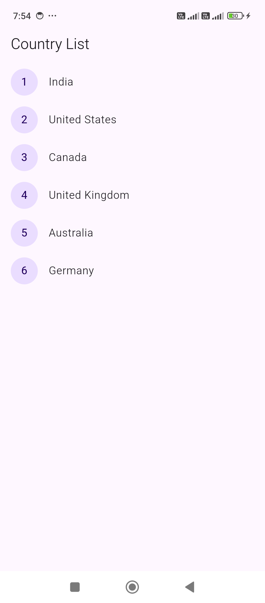

# 3 - Listview Builder with onTap go to DetailScreen

1. `CountryListScreen.dart`

```
import 'package:flutter/material.dart';

import '../models/Country.dart';
import 'CountryDetailScreen.dart';

class CountryListScreen extends StatelessWidget {

  final List<Country> countries = [
    Country(1, 'India'),
    Country(2, 'United States'),
    Country(3, 'Canada'),
    Country(4, 'United Kingdom'),
    Country(5, 'Australia'),
    Country(6, 'Germany'),
    // Add more countries as needed
  ];

  @override
  Widget build(BuildContext context) {
    return Scaffold(
      appBar: AppBar(
        title: Text('Country List'),
      ),
      body: ListView.builder(
        itemCount: countries.length,
        itemBuilder: (context, index) {
          final country = countries[index];
          return InkWell(
            onTap: () {
              Navigator.push(
                context,
                MaterialPageRoute(
                  builder: (context) => CountryDetailScreen(country: country),
                ),
              );
            },
            child: ListTile(
              leading: CircleAvatar(
                child: Text(country.id.toString()),
              ),
              title: Text(country.name),
            ),
          );
        },
      ),
    );
  }
}
```

2. `CountryDetailScreen.dart`

```
import 'package:flutter/material.dart';

import '../models/Country.dart';

class CountryDetailScreen extends StatelessWidget {

  final Country country;

  CountryDetailScreen({required this.country});

  @override
  Widget build(BuildContext context) {
    return Scaffold(
      appBar: AppBar(
        title: Text(country.name),
      ),
      body: Center(
        child: Text('Country ID: ${country.id}\nCountry Name: ${country.name}'),
      ),
    );
  }

}
```



