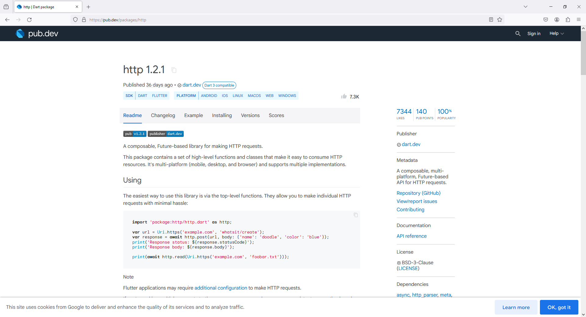
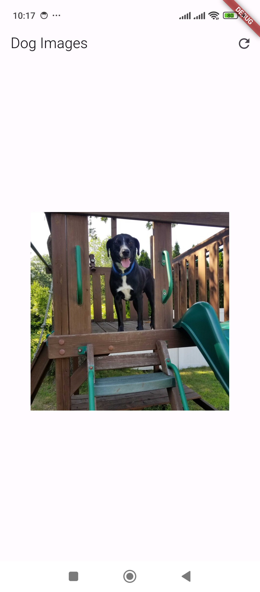
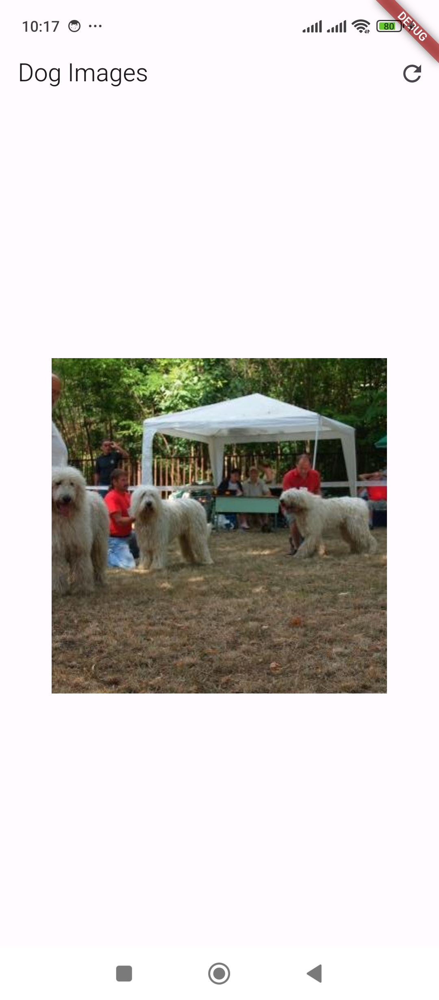

# 4 - Flutter - Dog Ceo - Project

1. Folder Setup

```
lib -> util

lib -> models

lib -> screens


File Setup

lib -> util -> Constants.dart

lib -> models -> Dog.dart

lib -> screens -> HomeScreen.dart

lib -> screens -> DogScreen.dart
```

2. Package Setup

http

```
https://pub.dev/packages/http
```



4. `Constants.dart`

```
class Constants{

  static const String BASE_URL = "https://dog.ceo/api";

  static const String RANDOM_DOG_IMAGE = "/breeds/image/random";

}
```

5. `Dog.dart`

```
class Dog {
  String message;
  String status;

  Dog({
    required this.message,
    required this.status,
  });

  Dog.fromJson(Map<String, dynamic> json)
      :
        message = json['message'],
        status = json['status'];
}
```

6. `HomeScreen.dart`

```
import 'dart:convert';
import 'package:flutter/material.dart';
import 'package:flutter_dog_ceo/util/Constants.dart';
import 'package:http/http.dart' as http;

class HomeScreen extends StatefulWidget {

  final String title;

  const HomeScreen({super.key, required this.title});

  @override
  State<HomeScreen> createState() => _HomeScreenState();

}

class _HomeScreenState extends State<HomeScreen> {

  String imageUrl = "";

  Future<void> fetchDogImage() async {

    final response = await http.get(Uri.parse(Constants.BASE_URL + Constants.RANDOM_DOG_IMAGE));

    if (response.statusCode == 200)
    {

      final Map<String, dynamic> data = json.decode(response.body);

      print(response.toString());

      setState(() {
        imageUrl = data['message'];
      });

    }
    else
    {
      throw Exception("Failed to load image");
    }
  }

  @override
  void initState() {
    super.initState();
    fetchDogImage();
  }

  Future<void> _handleRefresh() async {
    await fetchDogImage();
  }

  @override
  Widget build(BuildContext context) {
    return Scaffold(
      appBar: AppBar(
        title: Text(widget.title),
        actions: [
          IconButton(
            icon: Icon(Icons.refresh),
            onPressed: () {
              _handleRefresh();
            },
          ),
        ],
      ),
      body: Center(
        child: imageUrl.isNotEmpty
            ? Image.network(
          imageUrl,
          width: 300,
          height: 300,
          fit: BoxFit.cover,
        )
            : CircularProgressIndicator(),
      ),
    );
  }
}
```

7. `DogScreen.dart`

```
import 'dart:convert';
import 'package:flutter/material.dart';
import 'package:http/http.dart' as http;

import '../models/Dog.dart';
import '../util/Constants.dart';

class DogScreen extends StatefulWidget {

  final String title;

  const DogScreen({super.key, required this.title});

  @override
  State<DogScreen> createState() => _DogScreenState();
}

class _DogScreenState extends State<DogScreen> {

  Dog? dog;

  Future<void> fetchDogImage() async {

    final response = await http.get(Uri.parse(Constants.BASE_URL + Constants.RANDOM_DOG_IMAGE));

    if (response.statusCode == 200)
    {

      final Map<String, dynamic> data = json.decode(response.body);

      setState(() {
        dog = Dog.fromJson(data);
      });

    }
    else
    {
      throw Exception("Failed to load image");
    }

  }

  @override
  void initState() {
    super.initState();
    fetchDogImage();
  }

  @override
  Widget build(BuildContext context) {
    return Scaffold(
      appBar: AppBar(
        title: Text(widget.title),
      ),
      body: Center(
        child: dog != null
            ? Image.network(
          dog!.message,
          width: 300,
          height: 300,
          fit: BoxFit.cover,
        )
            : CircularProgressIndicator(),
      ),
    );
  }
}
```

8. `main.dart`

```
import 'package:flutter/material.dart';

// Make sure to import your HomeScreen file
import 'package:flutter_dog_ceo/screens/HomeScreen.dart';

void main() {
  runApp(MyApp());
}

class MyApp extends StatelessWidget {
  @override
  Widget build(BuildContext context) {
    return MaterialApp(
      title: 'Dog CEO App',
      theme: ThemeData(
        primarySwatch: Colors.blue,
      ),
      home: HomeScreen(title: 'Dog Images'), // Set your HomeScreen as the home property
    );
  }
}
```




