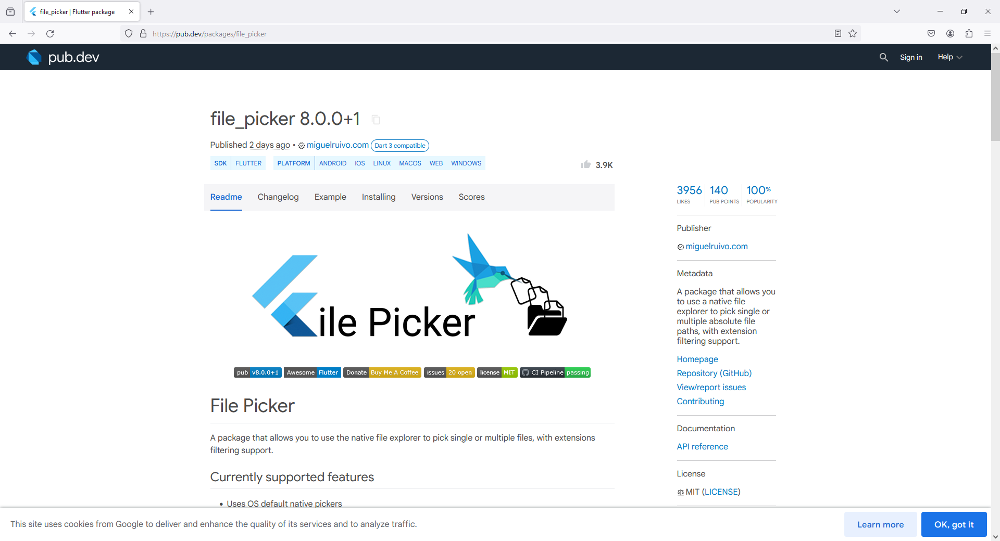
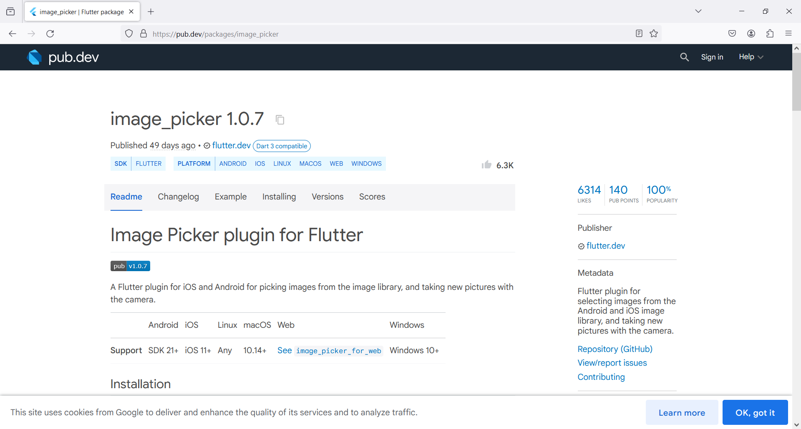
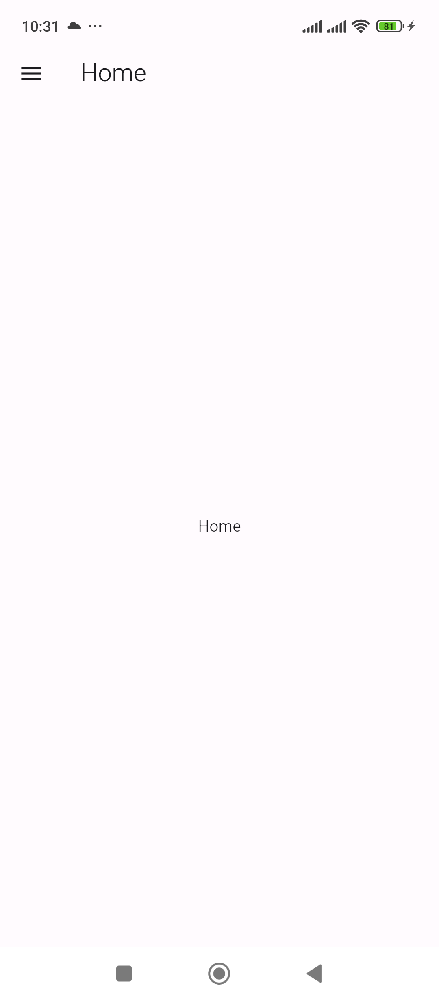
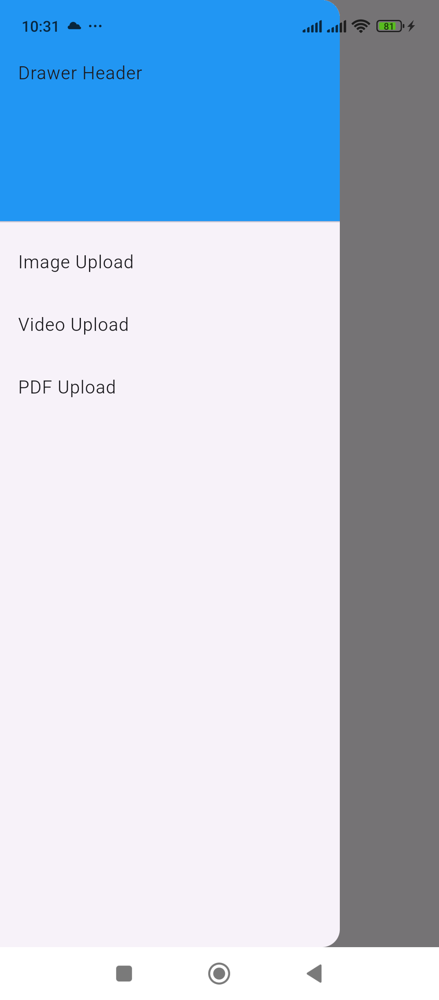
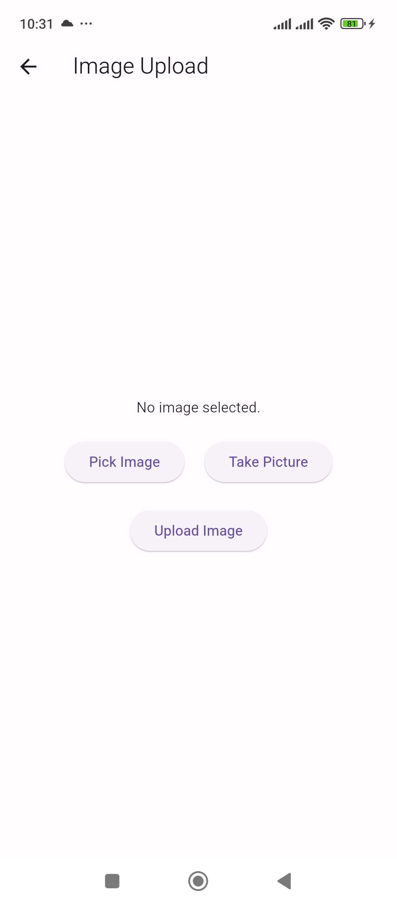
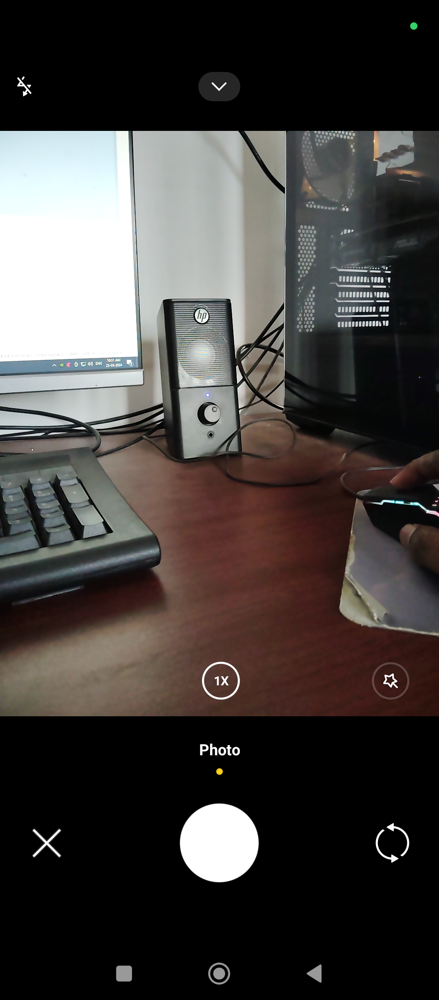
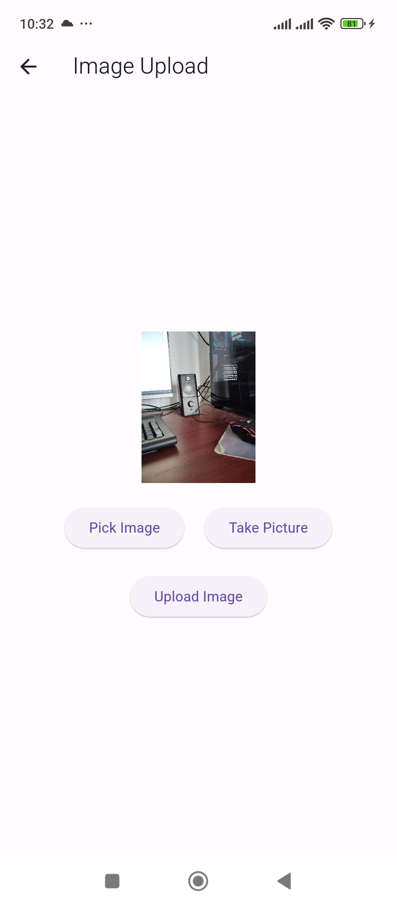
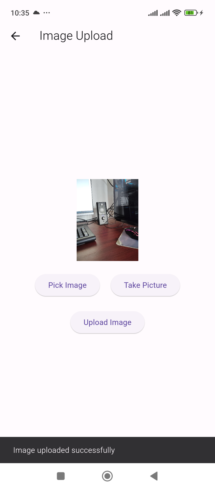
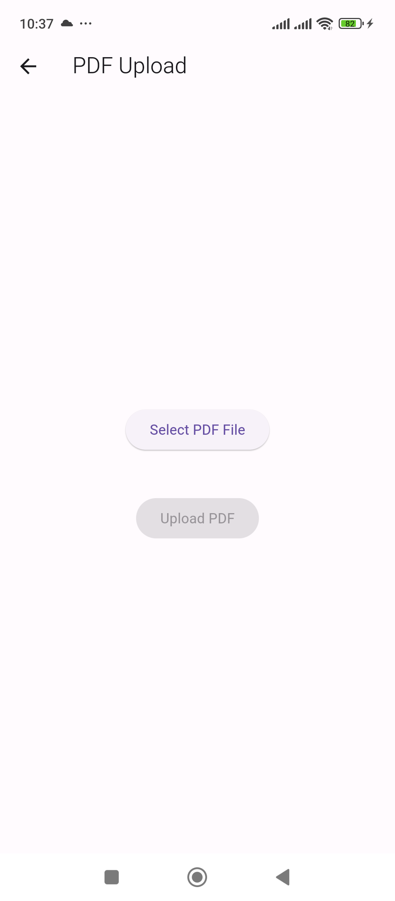

# 5 - Flutter Image Upload

1. Folder Setup

```
lib -> util

lib -> models

lib -> screens


File Setup

lib -> util -> Constants.dart

lib -> models -> Image.dart

lib -> screens -> ImageUploadScreen.dart

lib -> screens -> VideoUploadScreen.dart

lib -> screens -> PdfUploadScreen.dart

lib -> screens -> HomeScreen.dart
```

2. Package Setup

http

```
https://pub.dev/packages/http
```

Image Picker

```
https://pub.dev/packages/image_picker
```

File Picker

```
https://pub.dev/packages/file_picker
```

URL Launcher

```
https://pub.dev/packages/url_launcher
```







7. `Constants.dart`

```
class Constants {

  static const String BASE_URL="http://192.168.1.122:8000/api_v2";

  static const String IMAGE_UPLOAD_ROUTE ="/image/upload";

  static const String VIDEO_UPLOAD_ROUTE = "/video/upload";

  static const String PDF_UPLOAD_ROUTE = "/pdf/upload";
}
```

8. `Image.dart`

```
class Image {
  String message;

  Image({
    required this.message
  });

  Image.fromJson(Map<String, dynamic> json):
        message = json['message'];
}
```

9. `ImageUploadScreen.dart`

```
import 'dart:convert';
import 'dart:io';

import 'package:flutter/material.dart';
import 'package:http/http.dart' as http;
import 'package:image_picker/image_picker.dart';

import '../utils/Constants.dart';

class ImageUploadScreen extends StatefulWidget {

  final String title;

  const ImageUploadScreen({super.key, required this.title});

  @override
  State<ImageUploadScreen> createState() => _ImageUploadScreenState();
}

class _ImageUploadScreenState extends State<ImageUploadScreen> {

  File? _imageFile;
  final ImagePicker _picker = ImagePicker();

  Future getImageFromGallery() async {
    final pickedFile = await _picker.pickImage(source: ImageSource.gallery);

    setState(() {
      if (pickedFile != null) {
        _imageFile = File(pickedFile.path);
      }
    });
  }

  Future getImageFromCamera() async {
    final pickedFile = await _picker.pickImage(source: ImageSource.camera);

    setState(() {
      if (pickedFile != null) {
        _imageFile = File(pickedFile.path);
      }
    });
  }

  Future uploadImage() async {
    if (_imageFile == null) {
      // Handle case when no image is selected
      return;
    }

    var request = http.MultipartRequest(
      'POST',
      Uri.parse(Constants.BASE_URL + Constants.IMAGE_UPLOAD_ROUTE), // Replace with your Django API endpoint
    );
    request.files.add(await http.MultipartFile.fromPath('file', _imageFile!.path));

    try {
      var response = await request.send();
      if (response.statusCode == 200) {
        // Image uploaded successfully
        print('Image uploaded');

        // Display a Snackbar
        ScaffoldMessenger.of(context).showSnackBar(
          SnackBar(
            content: Text('Image uploaded successfully'),
            duration: Duration(seconds: 2),
          ),
        );
      } else {
        // Handle error
        print('Failed to upload image');
      }
    } catch (e) {
      // Handle error
      print('Error: $e');
    }
  }

  @override
  Widget build(BuildContext context) {
    return Scaffold(
      appBar: AppBar(
        title: Text(widget.title),
      ),
      body: Center(
        child: Column(
          mainAxisAlignment: MainAxisAlignment.center,
          children: <Widget>[
            _imageFile == null
                ? Text('No image selected.')
                : Image.file(
              _imageFile!,
              height: 150,
            ),
            SizedBox(height: 20),
            Row(
              mainAxisAlignment: MainAxisAlignment.center,
              children: <Widget>[
                ElevatedButton(
                  onPressed: getImageFromGallery,
                  child: Text('Pick Image'),
                ),
                SizedBox(width: 20),
                ElevatedButton(
                  onPressed: getImageFromCamera,
                  child: Text('Take Picture'),
                ),
              ],
            ),
            SizedBox(height: 20),
            ElevatedButton(
              onPressed: uploadImage,
              child: Text('Upload Image'),
            ),
          ],
        ),
      ),
    );
  }
}
```

10. `VideoUploadScreen.dart`

```
import 'dart:io';
import 'package:flutter/material.dart';
import 'package:http/http.dart' as http;
import 'package:image_picker/image_picker.dart';
import '../utils/Constants.dart';

class VideoUploadScreen extends StatefulWidget {
  final String title;

  const VideoUploadScreen({super.key, required this.title});

  @override
  State<VideoUploadScreen> createState() => _VideoUploadScreenState();
}

class _VideoUploadScreenState extends State<VideoUploadScreen> {
  File? _videoFile;
  final ImagePicker _picker = ImagePicker();

  Future getVideoFromGallery() async {
    final pickedFile = await _picker.pickVideo(source: ImageSource.gallery);

    setState(() {
      if (pickedFile != null) {
        _videoFile = File(pickedFile.path);
      }
    });
  }

  Future getVideoFromCamera() async {
    final pickedFile = await _picker.pickVideo(source: ImageSource.camera);

    setState(() {
      if (pickedFile != null) {
        _videoFile = File(pickedFile.path);
      }
    });
  }

  Future uploadVideo() async {
    if (_videoFile == null) {
      // Handle case when no video is selected
      return;
    }

    var request = http.MultipartRequest(
      'POST',
      Uri.parse(Constants.BASE_URL + Constants.VIDEO_UPLOAD_ROUTE),
    );
    request.files.add(await http.MultipartFile.fromPath('file', _videoFile!.path));

    try {
      var response = await request.send();
      if (response.statusCode == 200) {
        // Video uploaded successfully
        print('Video uploaded');

        // Display a Snackbar
        ScaffoldMessenger.of(context).showSnackBar(
          SnackBar(
            content: Text('Video uploaded successfully'),
            duration: Duration(seconds: 2),
          ),
        );
      } else {
        // Handle error
        print('Failed to upload video');
      }
    } catch (e) {
      // Handle error
      print('Error: $e');
    }
  }

  @override
  Widget build(BuildContext context) {
    return Scaffold(
      appBar: AppBar(
        title: Text(widget.title),
      ),
      body: Center(
        child: Column(
          mainAxisAlignment: MainAxisAlignment.center,
          children: <Widget>[
            _videoFile == null
                ? Text('No video selected.')
                : Text('Video selected: ${_videoFile!.path}'),
            SizedBox(height: 20),
            Row(
              mainAxisAlignment: MainAxisAlignment.center,
              children: <Widget>[
                ElevatedButton(
                  onPressed: getVideoFromGallery,
                  child: Text('Pick Video'),
                ),
                SizedBox(width: 20),
                ElevatedButton(
                  onPressed: getVideoFromCamera,
                  child: Text('Record Video'),
                ),
              ],
            ),
            SizedBox(height: 20),
            ElevatedButton(
              onPressed: uploadVideo,
              child: Text('Upload Video'),
            ),
          ],
        ),
      ),
    );
  }
}
```

11. `PdfUploadScreen.dart`

```
import 'dart:io';

import 'package:file_picker/file_picker.dart';
import 'package:flutter/material.dart';
import 'package:http/http.dart' as http;

import '../utils/Constants.dart';

class PdfUploadScreen extends StatefulWidget {
  final String title;

  const PdfUploadScreen({super.key,required this.title});

  @override
  State<PdfUploadScreen> createState() => _PdfUploadScreenState();
}

class _PdfUploadScreenState extends State<PdfUploadScreen> {
  File? _selectedPdf;

  Future<void> _openFileExplorer() async {
    try {
      FilePickerResult? result = await FilePicker.platform.pickFiles(
        type: FileType.custom,
        allowedExtensions: ['pdf'],
      );

      if (result != null && result.files.isNotEmpty) {
        setState(() {
          _selectedPdf = File(result.files.first.path!); // Access the path of the first file in the list
        });
      }
    } catch (e) {
      print("Error picking PDF: $e");
    }
  }

  Future<void> _uploadPdf() async {

    if (_selectedPdf == null) {
      return;
    }

    try {
      var request = http.MultipartRequest(
        'POST',
        Uri.parse(Constants.BASE_URL + Constants.PDF_UPLOAD_ROUTE), // Replace with your Django API endpoint
      );
      request.files.add(await http.MultipartFile.fromPath('file', _selectedPdf!.path)); // Using ! to indicate that _selectedPdf is not null
      var response = await request.send();

      if (response.statusCode == 200) {
        print('PDF uploaded successfully');
        // Handle successful upload

        // Display a Snackbar
        ScaffoldMessenger.of(context).showSnackBar(
          SnackBar(
            content: Text('PDF uploaded successfully'),
            duration: Duration(seconds: 2),
          ),
        );

      } else {
        print('Failed to upload PDF. Status code: ${response.statusCode}');
        // Handle upload failure
      }
    } catch (e) {
      print('Error uploading PDF: $e');
      // Handle upload error
    }
  }

  @override
  Widget build(BuildContext context) {
    return Scaffold(
      appBar: AppBar(
        title: Text('PDF Upload'),
      ),
      body: Center(
        child: Column(
          mainAxisAlignment: MainAxisAlignment.center,
          children: <Widget>[
            ElevatedButton(
              onPressed: _openFileExplorer,
              child: Text('Select PDF File'),
            ),
            SizedBox(height: 20),
            _selectedPdf != null
                ? Text(
              'Selected PDF: ${_selectedPdf!.path}',
              style: TextStyle(fontSize: 16),
            )
                : Container(),
            SizedBox(height: 20),
            ElevatedButton(
              onPressed: _selectedPdf != null ? _uploadPdf : null, // Disable button if _selectedPdf is null
              child: Text('Upload PDF'),
            ),
          ],
        ),
      ),
    );
  }
}
```

12. `HomeScreen.dart`

```
import 'package:flutter/material.dart';
import 'package:untitled/screens/ImageUploadScreen.dart';
import 'package:untitled/screens/PDFUploadScreen.dart';
import 'package:untitled/screens/VideoUploadScreen.dart';

import 'ImageUploadScreen.dart';

class HomeScreen extends StatefulWidget {
  final String title;

  const HomeScreen({super.key, required this.title});

  @override
  State<HomeScreen> createState() => _HomeScreenState();
}

class _HomeScreenState extends State<HomeScreen> {
  @override
  Widget build(BuildContext context) {
    return Scaffold(
      drawer: Drawer(
        // Add a ListView to the drawer. This ensures the user can scroll
        // through the options in the drawer if there isn't enough vertical
        // space to fit everything.
        child: ListView(
          // Important: Remove any padding from the ListView.
          padding: EdgeInsets.zero,
          children: [
            const DrawerHeader(
              decoration: BoxDecoration(
                color: Colors.blue,
              ),
              child: Text('Drawer Header'),
            ),
            ListTile(
              title: const Text('Image Upload'),
              onTap: () {
                // Update the state of the app.
                Navigator.pop(context);
                Navigator.of(context).push(
                  MaterialPageRoute(builder: (context) => ImageUploadScreen(title: 'Image Upload')),
                );
              },
            ),
            ListTile(
              title: const Text('Video Upload'),
              onTap: () {
                // Update the state of the app.
                Navigator.pop(context);
                Navigator.of(context).push(
                  MaterialPageRoute(builder: (context) => VideoUploadScreen(title: 'Video Upload')),
                );
              },
            ),
            ListTile(
              title: const Text('PDF Upload'),
              onTap: () {
                // Update the state of the app.
                Navigator.pop(context);
                Navigator.of(context).push(
                  MaterialPageRoute(builder: (context) => PdfUploadScreen(title: 'PDF Upload')),
                );
              },
            ),
          ],
        ),
      ),
      appBar: AppBar(
        title: Text(widget.title),
      ),
      body: Center(
        child: Text(widget.title),
      ),
    );
  }
}
```

13. `main.dart`

```
import 'package:flutter/material.dart';

// Make sure to import your HomeScreen file
import 'package:untitled/screens/HomeScreen.dart';

void main() {
  runApp(MyApp());
}

class MyApp extends StatelessWidget {

  @override
  Widget build(BuildContext context) {
    return MaterialApp(
      debugShowCheckedModeBanner: false,
      title: 'App',
      theme: ThemeData(
        primarySwatch: Colors.blue,
      ),
      home: HomeScreen(title: 'Home'), // Set your HomeScreen as the home property
    );
  }
}
```















