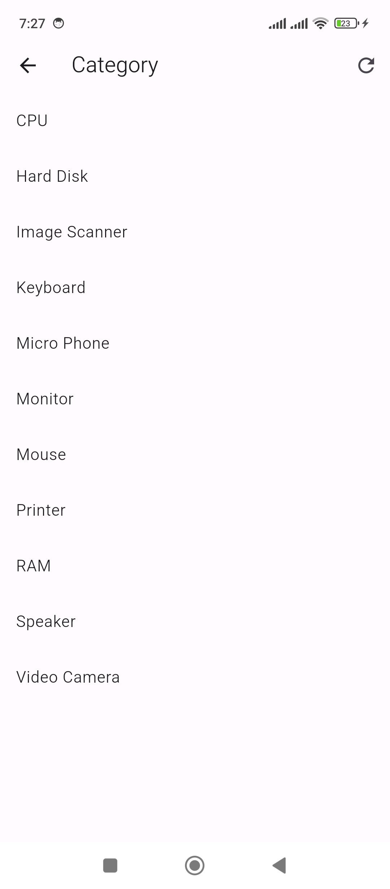

# 6 - Small Shop - Category Screen Implementation

1. Folder Structure

```
lib -> util

lib -> services

lib -> models

lib -> screens


File Setup

lib -> util -> Constants.dart

lib -> models -> Category.dart

lib -> screens -> CategoryScreen.dart
```

2. `Constants.dart`

```
class Constants{

  static const String SERVER_DOMAIN = "http://192.168.1.122:8000";

  static const String BASE_URL = SERVER_DOMAIN + "/api";

  static const String CATEGORY_ROUTE = "/categories";

}
```

3. `CategoryScreen.dart`

```
import 'dart:convert';
import 'package:flutter/material.dart';
import 'package:http/http.dart' as http;

import '../models/Category.dart';
import '../util/Constants.dart';

class CategoryScreen extends StatefulWidget {

  final String title;

  const CategoryScreen({super.key ,required this.title});

  @override
  State<CategoryScreen> createState() => _CategoryScreenState();
}

class _CategoryScreenState extends State<CategoryScreen> {

  // Initialize categories as an empty list
  late List<Category> categories = [];

  @override
  void initState() {
    super.initState();
    fetchData();
  }

  Future<void> fetchData() async {

    try {

      final response = await http.get(Uri.parse(Constants.BASE_URL + Constants.CATEGORY_ROUTE));

      if (response.statusCode == 200) {

        final List<dynamic> data = json.decode(response.body)['data'];

        setState(() {
          categories = data.map((category) => Category.fromJson(category)).toList();
        });

      } else {

        throw Exception('Failed to load categories ' + Constants.BASE_URL + Constants.CATEGORY_ROUTE);

      }
    } catch (e) {
      print('Error: $e');
    }

  }  

  Future<void> onRefresh() async {
    await fetchData();
  }

  @override
  Widget build(BuildContext context) {
    return Scaffold(
      appBar: AppBar(
        title: Text(widget.title),
        actions: [
          IconButton(
            icon: Icon(Icons.refresh),
            onPressed: () {
              fetchData();
            },
          ),
        ],
      ),
      body: RefreshIndicator(
        onRefresh: onRefresh,
        child: categories.isEmpty // Check if genres is empty before accessing its elements
            ? Center(child: CircularProgressIndicator())
            : ListView.builder(
          itemCount: categories.length,
          itemBuilder: (context, index) {
            return ListTile(
              title: Text(categories[index].name),
              onTap: () {                
              },
            );
          },
        ),
      ),
    );
  }
}
```

5. `main.dart`

```
import 'package:flutter/material.dart';
import 'package:flutter_small_shop/screens/CategoryScreen.dart';


Future<void> main() async {
  WidgetsFlutterBinding.ensureInitialized();

  runApp(MyApp());  
}

class MyApp extends StatelessWidget {
  @override
  Widget build(BuildContext context) {
    return MaterialApp(
      debugShowCheckedModeBanner: false,
      home: CategoryScreen(title: 'Category',),
    );
  }
}
```

6. `Category.dart`

```
class Category {
  int id;
  String name;

  Category({
    required this.id,
    required this.name,
  });

  Category.fromJson(Map<String, dynamic> json)
      :
        id = json['id'],
        name = json['name'];
}
```

