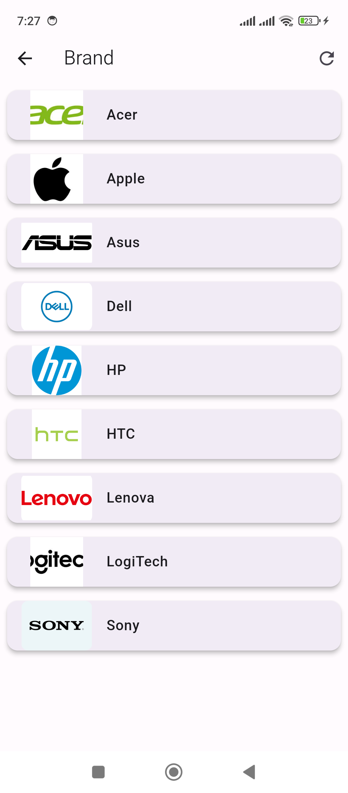

# 7 - Small Shop - Brand Screen Implementation

1. Folder Structure

```
lib -> util

lib -> services

lib -> models

lib -> screens


File Setup

lib -> util -> Constants.dart

lib -> models -> Brand.dart

lib -> screens -> BrandScreen.dart
```

2. `Constants.dart`

```
class Constants{

  ...
  ...

  static const String BRAND_ROUTE = "/brands";

}
```

3. `Brand.dart`

```
class Brand {
  int id;
  String name;

  Brand({
    required this.id,
    required this.name,
  });

  Brand.fromJson(Map<String, dynamic> json)
      :
        id = json['id'],
        name = json['name'];
}
```

4. `BrandScreen.dart`

```
import 'package:flutter/material.dart';
import 'package:http/http.dart' as http;
import 'dart:convert';

import '../models/Brand.dart';
import '../util/Constants.dart';
import 'product/ProductFilterByBrandScreen.dart';

class BrandScreen extends StatefulWidget {
  final String title;

  const BrandScreen({super.key, required this.title});

  @override
  State<BrandScreen> createState() => _BrandScreenState();
}

class _BrandScreenState extends State<BrandScreen> {
  late List<Brand> brands = [];

  @override
  void initState() {
    super.initState();
    fetchData();
  }

  Future<void> fetchData() async {
    try {
      final response =
      await http.get(Uri.parse(Constants.BASE_URL + Constants.BRAND_ROUTE));

      print(response.body.toString());

      if (response.statusCode == 200) {
        final List<dynamic> data = json.decode(response.body)['data'];

        setState(() {
          brands = data.map((brand) => Brand.fromJson(brand)).toList();
        });
      } else {
        throw Exception(
            'Failed to load brands ' + Constants.BASE_URL + Constants.BRAND_ROUTE);
      }
    } catch (e) {
      print('Error: $e');
    }
  }

  void navigateToProductScreen(Brand selectedBrand) {
    Navigator.push(
      context,
      MaterialPageRoute(
        builder: (context) =>
            ProductFilterByBrandScreen(title: selectedBrand.name, brand: selectedBrand),
      ),
    );
  }

  Future<void> onRefresh() async {
    await fetchData();
  }

  @override
  Widget build(BuildContext context) {
    return Scaffold(
      appBar: AppBar(
        title: Text(widget.title),
        actions: [
          IconButton(
            icon: Icon(Icons.refresh),
            onPressed: () {
              fetchData();
            },
          ),
        ],
      ),
      body: RefreshIndicator(
        onRefresh: onRefresh,
        child: brands.isEmpty
            ? Center(child: CircularProgressIndicator())
            : ListView.builder(
          itemCount: brands.length,
          itemBuilder: (context, index) {
            return Card(
              elevation: 4,
              margin: EdgeInsets.all(8),
              child: ListTile(
                title: Text(
                  brands[index].name,
                  style: TextStyle(
                    fontWeight: FontWeight.bold,
                  ),
                ),
                leading: ClipRRect(
                  borderRadius: BorderRadius.circular(8),
                  child: Image.network(
                    brands[index].image_path,
                    width: 80,
                    height: 80,
                    fit: BoxFit.scaleDown,
                  ),
                ),
                onTap: () {
                  navigateToProductScreen(brands[index]);
                },
              ),
            );
          },
        ),
      ),
    );
  }
}
```

5. `HomeScreen.dart`

```
import 'dart:convert';
import 'package:flutter/material.dart';
import 'package:flutter_secure_storage/flutter_secure_storage.dart';
import 'package:flutter_small_shop/screens/BrandScreen.dart';
import 'package:flutter_small_shop/screens/CartScreen2.dart';
import 'package:flutter_small_shop/screens/CategoryScreen.dart';
import 'package:flutter_small_shop/screens/WishlistScreen.dart';

import 'package:flutter_small_shop/screens/profile/ProfileScreen.dart';
import 'package:provider/provider.dart';

import '../models/Category.dart';
import '../services/AuthProvider.dart';
import '../util/Constants.dart';
import 'login/LoginScreen.dart';
import 'register/RegisterScreen.dart';

import 'package:http/http.dart' as http;

class HomeScreen extends StatefulWidget {
  final String title;

  const HomeScreen({super.key, required this.title});

  @override
  State<HomeScreen> createState() => _HomeScreenState();
}

class _HomeScreenState extends State<HomeScreen> {

  // Initialize categories as an empty list
  late List<Category> categories = [];


  Future<void> fetchData() async {

    try {

      final response = await http.get(Uri.parse(Constants.BASE_URL + Constants.CATEGORY_ROUTE));

      if (response.statusCode == 200) {

        final List<dynamic> data = json.decode(response.body)['data'];

        setState(() {
          categories = data.map((category) => Category.fromJson(category)).toList();
        });

      } else {

        throw Exception('Failed to load categories ' + Constants.BASE_URL + Constants.CATEGORY_ROUTE);

      }
    } catch (e) {
      print('Error: $e');
    }

  }

  final storage = new FlutterSecureStorage();

  @override
  void initState() {
    super.initState();
    readToken();
    fetchData();
  }


  void readToken() async {
    dynamic token = await this.storage.read(key: 'token');

    if (token != null) {
      // Explicitly cast the token to a String
      String tokenString = token as String;

      Provider.of<AuthProvider>(context, listen: false).tryToken(token: tokenString);

      print("read token");
      print(tokenString);
    } else {
      print("Token is null");
    }
  }

  @override
  Widget build(BuildContext context) {
    return Scaffold(
      appBar: AppBar(
        title: Text(widget.title),
      ),
      body: Column(
        children: [
          // Carousel or other content above the horizontal ListView

          // Add a SizedBox for spacing
          SizedBox(height: 10),
          // Horizontal ListView
          Container(
            height: 50, // Adjust the height as needed
            child: ListView.builder(
              scrollDirection: Axis.horizontal,
              itemCount: categories.length,
              itemBuilder: (context, index) {
                return Padding(
                  padding: const EdgeInsets.all(8.0),
                  child: ElevatedButton(
                    onPressed: () {
                      // Handle button press
                      // Access ScaffoldMessenger and show SnackBar
                      ScaffoldMessenger.of(context).showSnackBar(
                        SnackBar(
                          content:
                          Text('Button ${categories[index]} pressed'),
                        ),
                      );
                    },
                    // style: ButtonStyle(
                    //   backgroundColor: MaterialStateProperty.all(
                    //     isSelected[index] ? Colors.grey : buttonColors[index],
                    //   ),
                    // ),
                    child: Text(categories[index].name),
                  ),
                );
              },
            ),
          ),
          // Remaining content of the screen
          Expanded(
            child: Center(
              child: Text("Home Screen"),
            ),
          ),
        ],
      ),
      drawer: Drawer(
        child: Consumer<AuthProvider>(
          builder: (context, auth, child) {
            if (!auth.authenticated) {
              return ListView(
                children: [
                  ListTile(
                    title: Text('Login'),
                    leading: Icon(Icons.login),
                    onTap: () {
                      Navigator.of(context).push(
                        MaterialPageRoute(
                            builder: (context) =>
                                LoginScreen(title: 'Login')),
                      );
                    },
                  ),
                  ListTile(
                    title: Text('Register'),
                    leading: Icon(Icons.app_registration),
                    onTap: () {
                      // Handle logout logic
                      Navigator.pop(context);
                      Navigator.push(
                        context,
                        MaterialPageRoute(builder: (context) => RegisterScreen(title: 'Register')),
                      );
                    },
                  ),
                  ListTile(
                    leading: Icon(Icons.category, color: Colors.black),
                    title: const Text('Brand'),
                    onTap: () {
                      Navigator.pop(context);

                      Navigator.of(context).push(
                        MaterialPageRoute(
                            builder: (context) => BrandScreen(title: 'Brand')),
                      );
                    },
                  ),                  
                ],
              );
            } else {
              String avatar = auth.user?.avatar ?? '';
              String name = auth.user?.name ?? '';
              String email = auth.user?.email ?? '';
              String photo_path = auth.user?.photo_path ?? '';

              return ListView(
                children: [
                  UserAccountsDrawerHeader(
                    accountName: Text(name),
                    accountEmail: Text(email),
                    currentAccountPicture: CircleAvatar(
                      backgroundImage: NetworkImage(photo_path != '' && photo_path != Constants.IMAGE_ERROR_ROUTE ? photo_path : avatar),
                    ),
                    decoration: BoxDecoration(
                      color: Colors.blueGrey,
                    ),
                  ),
                  ListTile(
                    leading: Icon(Icons.verified_user, color: Colors.black),
                    title: const Text('Profile'),
                    onTap: () {
                      Navigator.pop(context);

                      Navigator.of(context).push(
                        MaterialPageRoute(
                            builder: (context) => ProfileScreen(title: "Profile")),
                      );
                    },
                  ),
                  ListTile(
                    leading: Icon(Icons.category, color: Colors.black),
                    title: const Text('Category'),
                    onTap: () {
                      Navigator.pop(context);

                      Navigator.of(context).push(
                        MaterialPageRoute(
                            builder: (context) =>
                                CategoryScreen(title: 'Category')),
                      );
                    },
                  ),
                  ListTile(
                    title: Text('Logout'),
                    leading: Icon(Icons.logout),
                    onTap: () {
                      Provider.of<AuthProvider>(context, listen: false).logout();
                    },
                  ),
                ],
              );
            }
          },
        ),
      ),
    );
  }
}
```

6. `main.dart`

```
import 'package:flutter/material.dart';
import 'package:flutter_native_splash/flutter_native_splash.dart';
import 'package:flutter_small_shop/screens/HomeScreen.dart';
import 'package:flutter_small_shop/services/AuthProvider.dart';
import 'package:flutter_small_shop/services/CartProvider.dart';
import 'package:provider/provider.dart';


Future<void> main() async {
  WidgetsFlutterBinding.ensureInitialized();


  await Future.delayed(const Duration(seconds: 2));
  FlutterNativeSplash.remove();

  // runApp(MyApp());

  runApp(
      MultiProvider(
        providers: [
          ChangeNotifierProvider(create: (context) => AuthProvider()),
          ChangeNotifierProvider(create: (context) => CartProvider()),  // Add CartProvider
        ],
        child: MyApp(),
      )
  );
}

class MyApp extends StatelessWidget {
  @override
  Widget build(BuildContext context) {
    return MaterialApp(
      debugShowCheckedModeBanner: false,
      home: HomeScreen(title: 'Home',),
    );
  }
}
```

